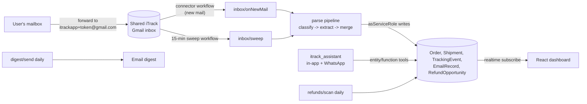

# iTrack: your delivery command center

**Forward your order emails once. See every package you're waiting for, live, and get paid when
they're late.**

iTrack turns a messy inbox full of order confirmations, shipping notices, and delivery updates into
one live dashboard. Each user gets a personal iTrack email address; every purchase becomes a card
with product imagery, live status, a progress bar toward the promised date, the full communication
timeline, and, when a package runs late, a drafted refund claim. A WhatsApp assistant answers
"where's my order?" from your phone.

Built for the **Base44 Dev Build-Off** (July 2026) on the Base44 developer platform, CLI-first.

- **Live app:** https://i-track-2bdb7160.base44.app
- **Requirements:** [PRD.md](PRD.md) - **Build log:** [BUILD_PLAN.md](BUILD_PLAN.md) -
  **Platform feedback:** [FEEDBACK.md](FEEDBACK.md)

## How it works



Every inbound email is processed exactly once (idempotent by Gmail message id), routed ONLY on an
exact alias-token match (anything else lands in an admin quarantine, never guessed), classified and
extracted by one `InvokeLLM` call with a strict JSON schema, and merged into orders through a
single-writer status engine with monotonic transitions (a late-arriving "shipped" email can never
un-deliver a package).

## Backend checklist mapping (what the judges verify)

| Checklist item | Where it lives in iTrack |
|---|---|
| Authentication & user management | Built-in Base44 auth (email/password + OTP + Google); per-user isolation via RLS on `owner_email` |
| Database / entities | 8 entities (`base44/entities/`) with row-level security; writes are service-role-only |
| Backend functions (Deno) | 12 functions (`base44/functions/`): ingest webhook, sweep, refund scan, digest, and every mutation |
| AI / LLM / agents | Email classify+extract with `response_json_schema`, same-order arbitration, claim drafting, `itrack_assistant` agent with entity + function tools |
| Real-time subscriptions | Dashboard and detail views subscribe to Order + TrackingEvent; cards and toasts update live |
| File & media storage | Product images and merchant logos re-hosted via `UploadFile` (no hotlinking merchant CDNs) |

## Architecture choices worth reading

- **Shared inbox + plus-aliases, not per-user OAuth.** One Gmail account owned by the app, one
  Base44 shared connector, `itrackapp+<token>@gmail.com` per user. No Google Cloud project, no
  restricted-scope (CASA) verification, works with ANY email provider the user forwards from. The
  15-minute sweep cron makes ingest self-healing when the webhook misses.
- **All writes go through backend functions with `asServiceRole`.** The frontend SDK is
  read + invoke + subscribe only. Ownership is an explicit `owner_email` stamped server-side from
  the auth token (never from the request body); RLS reads key on it.
- **One status writer.** The merge engine recomputes order status from the full event history:
  monotonic by construction (max rank), delay annotates without advancing, terminal states stick.
  `scripts/tests/` holds the unit suite (`deno test scripts/tests/`).
- **Refund radar.** A daily scan matches overdue orders against seeded merchant policies
  (Temu / AliExpress / Amazon / Shein / PayPal / chargeback windows), upserts one opportunity per
  order+policy (dismissed never resurfaces), and drafts the claim message with the LLM.

## Repo layout

```
base44/
  entities/         8 JSONC schemas (RLS included)
  functions/        12 Deno functions: inbox/, account/, settings/, orders/, refunds/, digest/
  shared/           parse pipeline: aliasRouter, htmlToText, extract (LLM), mergeEngine,
                    carriers, rehost, gmail, pipeline, responses
  agents/           itrack_assistant.jsonc
  connectors/       gmail.jsonc (readonly scope)
src/                Vite + React frontend (pages/, components/, api/, lib/)
scripts/            base44 exec seed/verify tools + deno unit tests
```

## Running it

Prereqs: Node >= 20.19, Deno, the `base44` CLI (`npm i -g base44`), a Base44 account.

```bash
npm install
base44 link            # link your own app id (base44/.app.jsonc is gitignored)
base44 entities push   # register the 8 schemas
base44 functions deploy
base44 agents push
cat scripts/seed-policies.ts | base44 exec   # seed the 6 refund policies
npm run build && base44 deploy -y
```

Scheduling note: this app generation uses Base44 **Workflows** (legacy `function.jsonc` automations
are disabled by the platform). The three schedules (15-min sweep, daily refund scan, daily digest)
are created from the dashboard AI chat; see FEEDBACK.md for the platform details.

Local dev: `base44 dev` (frontend on :5173 against the hosted backend). Unit tests:
`deno test scripts/tests/`.

## Production path (post-competition roadmap)

The forwarding model is deliberately provider-agnostic and verification-free. The upgrade path:
per-user Gmail OAuth via Base44 app-user connectors (needs a BYO Google OAuth app and Google's
restricted-scope CASA review, or a 100-user unverified cap), Outlook connector, carrier-API
enrichment (17track/AfterShip) for scan-level tracking between emails, browser extension for
"add from order page", and Hebrew/RTL localization.

## Privacy

Full email bodies are processed transiently and never stored: EmailRecord keeps a snippet of at
most 2,000 characters. Product images are re-hosted (stripping merchant tracking parameters).
`account/wipe` deletes every row a user owns. Unroutable mail is visible to admins only.
