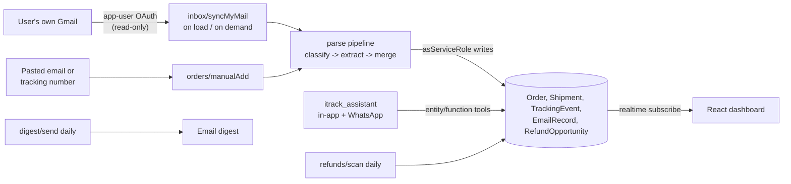

# iTrack: your delivery command center

**Drop in an order email. See every package you're waiting for, live, and get paid when
they're late.**

iTrack turns a messy inbox full of order confirmations, shipping notices, and delivery updates into
one live dashboard. Add an order by pasting its email (or connecting your Gmail, read-only); every
purchase becomes a card with product imagery, live status, a progress bar toward the promised date,
the full communication timeline, and, when a package runs late, a drafted refund claim. A WhatsApp
assistant answers "where's my order?" from your phone.

Built for the **Base44 Dev Build-Off** (July 2026) on the Base44 developer platform, CLI-first.

- **Live app:** https://i-track-2bdb7160.base44.app
- **Requirements:** [PRD.md](PRD.md) - **Build log:** [BUILD_PLAN.md](BUILD_PLAN.md) -
  **Platform feedback:** [FEEDBACK.md](FEEDBACK.md)

> **Ingest status:** both paths are live. Per-user Gmail sync (`inbox/syncMyMail` + the Base44
> app-user connector) connects in one click, read-only, and imports the last 60 days of order
> mail; because the Google consent screen runs in Testing mode, only allowlisted test users can
> connect a real mailbox. Manual add (paste an order email or a tracking number) is the equal
> second path, drives the identical pipeline, and works for everyone, including judges.

## Judge it in 60 seconds

1. Open https://i-track-2bdb7160.base44.app and register (any email, or Google).
2. Click **Add order** and paste the whole of
   [demo/sample-emails/01-order-confirmation.txt](demo/sample-emails/01-order-confirmation.txt).
   The LLM pipeline extracts merchant, items, total, and promised date, and a live card appears.
3. Open the dashboard in a SECOND window, then paste
   [demo/sample-emails/02-shipping-notice.txt](demo/sample-emails/02-shipping-notice.txt) in the
   first: it merges into the SAME order (merge engine), the status advances to shipped, the
   timeline gains a second event with its source snippet and tracking number, and the second
   window updates without a refresh (realtime subscriptions).
4. Click the chat bubble and ask "where is my headphone stand?": the agent answers from your own
   rows only (entity tools inherit RLS; verified with a two-account leak test).

## How it works



Each user's mailbox is scanned through their own OAuth token (request-scoped; sync runs on app
load, on demand, and on an interval while the app is open). Every email is processed exactly once
(idempotent per owner + Gmail message id), classified and extracted by one `InvokeLLM` call with a
strict JSON schema, and merged into orders through a single-writer status engine with monotonic
transitions (a late-arriving "shipped" email can never un-deliver a package). First connect
imports the last 60 days of order mail.

## Backend checklist mapping (what the judges verify)

| Checklist item | Where it lives in iTrack |
|---|---|
| Authentication & user management | Built-in Base44 auth (email/password + OTP + Google); per-user isolation via RLS on `owner_email` |
| Database / entities | 7 entities (`base44/entities/`) with row-level security; writes are service-role-only |
| Backend functions (Deno) | 12 functions (`base44/functions/`): per-user Gmail sync, refund scan, digest, image enrichment, and every mutation |
| AI / LLM / agents | Email classify+extract with `response_json_schema`, same-order arbitration, claim drafting, `itrack_assistant` agent with entity + function tools |
| Real-time subscriptions | Dashboard and detail views subscribe to Order + TrackingEvent; cards and toasts update live |
| File & media storage | Product images and merchant logos re-hosted via `UploadFile` (no hotlinking merchant CDNs) |

## Architecture choices worth reading

- **Per-user Gmail OAuth (Base44 app-user connector).** Each user's token reads only their own
  mailbox; tokens are encrypted and request-scoped, so all processing happens as the signed-in
  user and there is no cross-user path by construction. The trade-off (accepted): no background
  sync while the user is away; the daily digest and refund scan work off already-synced data.
- **All writes go through backend functions with `asServiceRole`.** The frontend SDK is
  read + invoke + subscribe only. Ownership is an explicit `owner_email` stamped server-side from
  the auth token (never from the request body); RLS reads key on it.
- **One status writer.** The merge engine recomputes order status from the full event history:
  monotonic by construction (max rank), delay annotates without advancing, terminal states stick.
  `scripts/tests/` holds the unit suite (`deno test scripts/tests/`).
- **Refund radar, evidence-gated.** A daily scan opens at most ONE case per late order and stages
  it by lateness (`late` -> `likely_lost` -> `dispute`, or `delivered_late`). A refund route only
  appears with real evidence: a merchant-policy domain match, or a payment-rail match against how
  the user actually paid; no evidence means an honest "add how you paid" placeholder, never a
  fabricated claim. Amounts are honest (only a policy that refunds the order total ever shows a
  number), claim drafts are stage-aware and addressed to the right party, and a case whose order
  arrives (or gets archived) is retired automatically. Dismissed never resurfaces.

## Repo layout

```
base44/
  entities/         7 JSONC schemas (RLS included)
  functions/        12 Deno functions: inbox/syncMyMail, account/{bootstrap,wipe},
                    settings/update, orders/{manualAdd,setStatus,setPaymentMethod,
                    enrichProductImages,backfillImages}, refunds/{scan,updateStatus},
                    digest/send
  shared/           parse pipeline: htmlToText, extract (LLM), mergeEngine, carriers,
                    rehost, gmail, pipeline, enrichPolicy, responses
  agents/           itrack_assistant.jsonc
src/                Vite + React frontend (pages/, components/, api/, lib/)
demo/sample-emails/ paste-ready sample order emails for evaluation
scripts/            base44 exec seed/verify tools + deno unit tests
tests/              deno unit tests for the pure pipeline logic
```

## Running it

Prereqs: Node >= 20.19, Deno, the `base44` CLI (`npm i -g base44`), a Base44 account.

```bash
npm install
base44 link            # link your own app id (base44/.app.jsonc is gitignored)
base44 entities push   # register the 7 schemas
base44 functions deploy
base44 agents push
cat scripts/seed-policies.ts | base44 exec   # seed the 6 refund policies
npm run build && base44 deploy -y
```

Unit tests (101 cases over the pure pipeline logic): `deno test tests/ scripts/tests/`.

Gmail sync needs a per-user (app-user) Gmail connector: register a Google OAuth client
(scope `gmail.readonly`) in Base44 Workspace Settings -> Connectors -> Gmail -> App user
credential, then `base44 secrets set GMAIL_CONNECTOR_ID=<connector-id>`. Until then, manual add
works fully. With the Google consent screen in Testing mode, only allowlisted test users can
connect their Gmail.

Scheduling note: this app generation uses Base44 **Workflows** (legacy `function.jsonc` automations
are disabled by the platform). The two schedules (daily refund scan, daily digest) are created
from the dashboard AI chat; see FEEDBACK.md for the platform details.

Local dev: `base44 dev` (frontend on :5173 against the hosted backend). Unit tests:
`deno test scripts/tests/`.

## Production path (post-competition roadmap)

Going to production with per-user Gmail OAuth means Google's restricted-scope verification (CASA
security assessment) to lift the 100-test-user cap; until then the consent screen runs in Testing
mode. Roadmap beyond that: background sync via Gmail push notifications or scheduled per-user
refresh (needs platform support for enumerating app-user connections from crons), an Outlook
connector, an email-forwarding ingest lane for non-Gmail providers, carrier-API enrichment
(17track/AfterShip), a browser extension, and Hebrew/RTL localization.

## Privacy

Gmail access is read-only and per-user; tokens are platform-encrypted and request-scoped. Full
email bodies are processed transiently and never stored: EmailRecord keeps a snippet of at most
2,000 characters. Product images are re-hosted (stripping merchant tracking parameters).
`account/wipe` deletes every row a user owns, and users can disconnect Gmail anytime in Settings.
